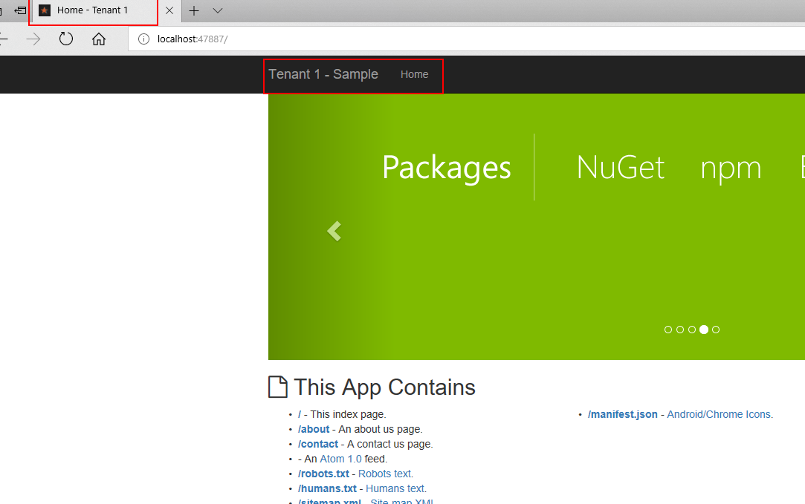
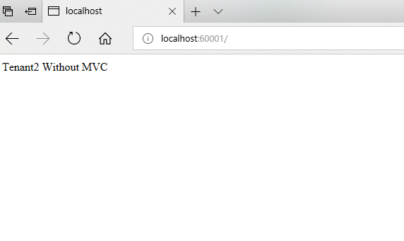

# UnobtrusiveMultitenancy
An Unobtrusive Multitenancy helper for (new or existing) Asp.Net Core project


The goal of this project is to add the multitenancy functionality to an ASP.NET Core application (existing or new) without modification (or very little) of code.

It's support multitenant DI ,sandbox services, etc.

Just add a line in the Program.cs and add a configuration file.

And voila your application is multitenant.

Inspired by [saaskit](https://github.com/saaskit/saaskit) and [Explanation of  multitenancy with autofac in ASP.NET Core](https://stackoverflow.com/questions/38940241/autofac-multitenant-in-an-aspnet-core-application-does-not-seem-to-resolve-tenant).


## Continuous integration

| Build server                | Platform     | Build status                                                                                                                                                        |
|-----------------------------|--------------|---------------------------------------------------------------------------------------------------------------------------------------------------------------------|
| AppVeyor                    | Windows      | [](https://ci.appveyor.com/project/Courio-Dev/unobtrusivemultitenancy)                 | 
| Travis                      | Linux / OS X | [](https://travis-ci.org/Courio-Dev/UnobtrusiveMultitenancy)                                           |

## Code Coverage

<sup>Codecov</sup> [](https://codecov.io/gh/Courio-Dev/UnobtrusiveMultitenancy)


## Features

- Per Tenant Middleware
- Per Tenant DI
- Per Tenant Services
- Per Tenant HostingEnvironment (Coming soon)
- Per Tenant Configuration (Coming soon)
- Per Tenant LoggerFactory (Coming soon)

## Installation

Package nuget coming soon.

## Getting started

#### Initialization

Replace this line  ``` .UseStartup<Startup>() ```  in your ```Program.cs``` like in example below.

Before you need to add ```MultitenancyOptions.json```  config file either at the Root folder or in the Configs folder or provide your own configuration object which contains ```MultitenancyOptions```

``` json
{
  "MultitenancyOptions": {
    "Tenants": [
      {
        "Name": "Tenant 1",
        "Hostnames": [
          "localhost:47887",
          ...
        ],
        "Theme": "",
        "ConnectionString": ""
      },
      {
        "Name": "Tenant 2",
        "Hostnames": [
          ...
          "localhost:60001"
        ],
        "Theme": "",
        "ConnectionString": ""
      }
    ]
  }
}
``` 

You have two options :

1. Use Default Conventions

``` csharp
public class Program
{
    public static void Main(string[] args)
    {
        BuildWebHost(args).Run();
    }

    public static IWebHost BuildWebHost(string[] args) =>
        WebHost.CreateDefaultBuilder(args)
            .UseUnobtrusiveMulitenancyStartupWithDefaultConvention<Startup>()
            .Build();
}
```

With this , you have an access to an object name ```AppTenant``` and you can add use this in your views. In your ```_ViewImports.cshtml``` 
``` cshtml
@inject Puzzle.Core.Multitenancy.Internal.AppTenant Tenant;
```

In cshtml files you can use tenant like this:
``` html
<a asp-controller="Home" asp-action="Index" class="navbar-brand">@(Tenant?.Name ?? "")</a>
``` 

2. Use YourCustom Configuration
 
Use this signature, and provide your own ```TTenant``` and ```TResolver```
```csharp
public static IWebHostBuilder UseUnobtrusiveMulitenancyStartup<TStartup, TTenant, TResolver>
            (this IWebHostBuilder hostBuilder, IConfiguration multitenancyConfiguration = null)
                where TStartup : class
                where TTenant : class
                where TResolver : class, ITenantResolver<TTenant>
        
```

And after use your own tenant in your view like in option 1.

The result is :




#### Regiter services per tenant

Add a method call ```ConfigurePerTenantServices``` in your ```Startup``` class and you have access in TENANT.
See example below:

```csharp
public void ConfigurePerTenantServices(IServiceCollection services, AppTenant tenant)
{
            if (tenant.Id == "Tenant-1".ToLowerInvariant())
            {
                services.AddMvc();
            }
            else if (tenant.Id == "Tenant-2".ToLowerInvariant())
            {
            }
}
        
```


```csharp
public void Configure(IApplicationBuilder application, IApplicationLifetime appLifetime)
{
            application.UseStaticFiles();

            application.UsePerTenant<AppTenant>((tenantContext, builder) =>
            {
                if (tenantContext.Tenant.Id == "Tenant-1".ToLowerInvariant())
                {
                    builder.UseMvcWithDefaultRoute();
                }
                else if (tenantContext.Tenant.Id == "Tenant-2".ToLowerInvariant())
                {
                    builder.Run(async ctx =>
                    {
                        ctx.Response.StatusCode = (int)HttpStatusCode.OK;
                        await ctx.Response.WriteAsync(string.Format("{0} Without MVC", tenantContext.Tenant.Name));
                    });
                }
            });
}
```

and you have this result :



## References

- [Saaskit](https://github.com/saaskit/saaskit) 
- [Explanation of  multitenancy with autofac in ASP.NET Core](https://stackoverflow.com/questions/38940241/autofac-multitenant-in-an-aspnet-core-application-does-not-seem-to-resolve-tenan/38960122#38960122)
